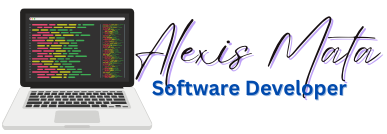

 

___

Soy un desarrollador, tanto frontend como backend, y con entusiasmo por seguiré creciendo en mi carrera para poder fortalecer mi aprendizaje en las nuevas tecnología y herramientas que desde muchos años han estado evolucionando para dar mejores soluciones inform´ñaticas.

En esta oportunidad les presentaré un poco todo lo que, día a día, estaré aprendiendo de React.JS completamente desde cero, para ir creciendo en conocimientos y habilidades. 

Tomando en cuenta que soy un estudiante autodidacta, he ido viendo una cantidad de videostutoriales de muchos Desarrolladores de Front-End, pero me enfocaré en 4 de ellos que los considero bastantes buenos en sus explicaciones. 

   - Midudev [El canal de @middev](https://www.youtube.com/@midudev)
   - Hola Mundo [El canal de @HolaMundoDev](https://www.youtube.com/@HolaMundoDev) 
   - Jonmircha [El canal de @jonmircha](https://www.youtube.com/@jonmircha)
   - Fazt [El canal de @FaztTech](https://www.youtube.com/@FaztTech)

La forma como explican sus conocimientos sobre esta librería es muy buena y completa. ¡Lo recomiendo 100%!

___
# 30 Días y 30 Proyectos | Aprendiendo desde 0 React.JS
___

Este repositorio contendrá cada ejercicio, ejemplos y alguno que otro proyecto con el cual estaré practicando segun vaya avanzando en los videos tutoriales. 

Asi como también algún proyecto realizado por mi cuenta con lo aprendido.

